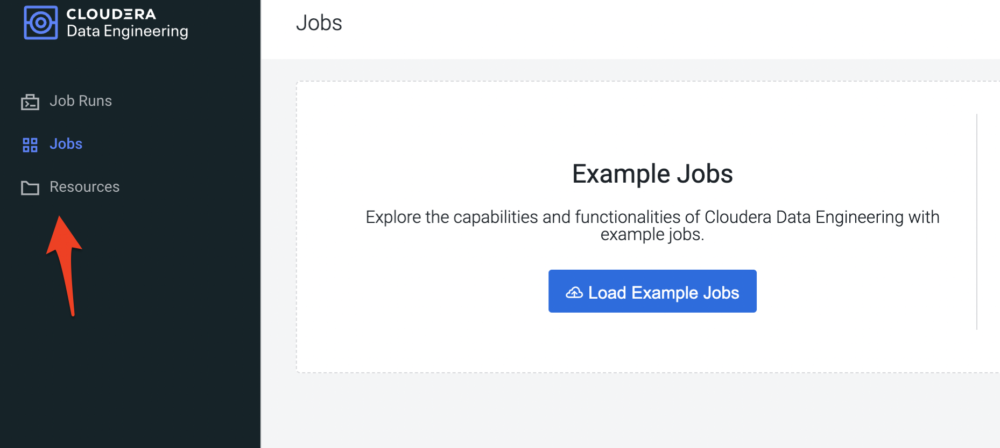
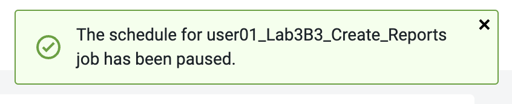
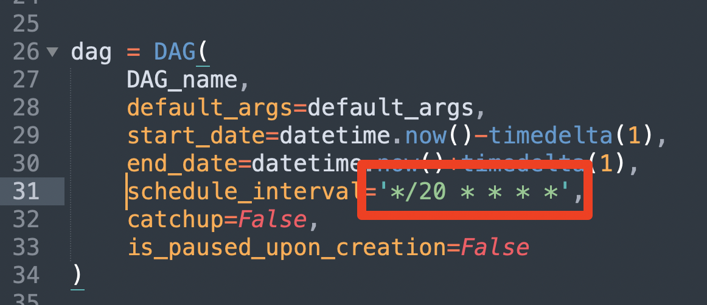

= 
:toc: macro

= CDE Workshop 
:toc: macro

= 作業ガイド
:toc: macro

*目次*

== 導入

---

このドキュメントは、Cloudera Data Platform (CDP) のData Engineering Data ServiceであるCDE の機能をユーザーに紹介することを目的としています。 このワークショップの中で、オートスケーリングインするインフラの上で Spark ジョブを実行およびオーケストレーションすることがいかに簡単かを体験していただきます。 複数のジョブを調整するために Airflow を使用します。 

このワークショップの中で:

* 特定のテナントの既存/登録済み CDP 環境で実行される有効な CDE サービスが提供されます。 

* Spark ワークロードの実行環境として、仮想クラスターが指定されます 

* サンプル Spark ジョブをアドホック ジョブとして実行します。
  ** PySpark 
  ** Spark-scala 

* 同じ Spark ジョブをスケジューリングして実行します。 

* Airflow を利用して、一連の Spark ジョブを調整し、処理フローとして実行します。
+

* CDE CLI を使用して、ターミナル/PowerShell からジョブをトリガーします。
+

* Atlas を使用してデータ リネージを確認し、CDE Data サービスのオートスケーリング機能を確認します。

== 前提条件

=== 環境へのアクセスを確認する

* 共有リンクを開き、自分に割り当てられた認証情報を使用してログインします。

<開始時にインストラクターから共有されます>

* 以下に示すように、CDP コンソールが表示されます。

=== リソースをダウンロードする

<ダウンロードリンクはインストラクターから共有されます>

* ダウンロードされたzipファイルを解凍します。

ZIP ファイルを解凍すると、フォルダー構造は次のようになります。

=== ファイルを更新する

* 各スクリプトをテキストエディターで開き、スクリプトに記載されているように必要な値を更新します。 
  ** すべてのスクリプトについて、割り当てられているユーザー名で「changeme」の部分を更新します。 

== Lab 1 - CDE Data Serviceを触ってみる

---

Cloudera Data Engineering (CDE) は、Cloudera Data Platform 用のサーバーレス サービスであり、オートスケーリングできる仮想クラスターにジョブを送信できます。

CDE サービスには、いくつかのコンポーネントが含まれます。

* *環境*
  ** 特定の仮想ネットワークを含むクラウドプロバイダーアカウントの論理サブセット。
* *CDE Data Service*
  ** 長時間実行される Kubernetes クラスターと、仮想クラスターを管理するサービス。仮想クラスタを作成する前に、環境で CDE サービスを有効にする必要があります。
* *仮想クラスター*
  ** 定義された CPU とメモリの範囲を持つ個々のオートスケーリングクラスター。CDE の仮想クラスタは、必要に応じて作成および削除できます。ジョブはクラスターに関連付けられます。
* *ジョブ*
  ** アプリケーションコードと、定義された構成およびリソース。ジョブは、オンデマンドで実行することも、スケジュールすることもできます。
* *リソース*
  ** Python ファイルやアプリケーションJAR、依存関係、ジョブに必要なその他の参照ファイルなどの定義済みのファイルのまとめ。
* *Job run*
  ** 個々のジョブ実行.

上記のコンポーネントには、次の方法でアクセスできます。

* CDP コンソールに移動し、 *[Data Engineering]* をクリックします。 

* CDEのホームページが表示されます。

* このワークショップで使用するCDEサービスを実行する必要があります。これを確認するには  、画面の左側のメニューにある *[Administration]* オプションを選択します。すべての CDE サービスとそのステータスを確認できます。

image:img_7.png[]

* 対象のCDEサービスで *、鉛筆アイコン* をクリックし、サービスに関連する設定やその他の詳細を確認します。

  image:img_8.png[]

image:img_9.png[]

* 各タブをクリックして、CDEサービスに関連するすべての詳細を確認します。 
* 完了したら、左側のタブの *[home]* をクリックして、CDEホームページに戻ります。このページには、アクティブな CDE サービスと関連するクラスタが表示されます。自分に割り当てられている仮想クラスターにアクセスすることから始めましょう。
* 仮想クラスターへのアクセス
  ** Step 1 : 適切な CDE サービスを選択します。
    *** *[Administration]* ページに移動し、CDE サービスを選択します (この場合は cde-handson-service)

  ** Step 2 : 仮想クラスターの選択
    *** CDE サービスを選択し、割り当てられた仮想クラスターをクリックします。

image:img_11.png[]

== Lab 2 - アドホック Spark ジョブの作成と実行 

---

このラボでは、Spark ジョブを作成し、アドホックベースで、つまりスケジュールなしで実行します。このラボの一環として、Spark ジョブを使用して対処できる 2 つの簡単なユースケースを取り上げました。 

. Spark を使用したログデータクレンジング 
. 給与保護プログラムデータの分析
  .. Report 1: 雇用があるテキサス州のすべての都市の内訳
  .. Report 2: 雇用を持っている企業類型の内訳
. 既存のデータウェアハウスを使用してデータを拡張する PySpark ジョブ

=== 
+
リソースの作成

* 対象仮想クラスター[クラスター名: _<ユーザー名>-vc_ ]のタイルで *、[View Jobs]* をクリックします。これにより、ジョブの実行、ジョブ、およびリソースの詳細を含む新しいページが開きます。  

* 左側のペインで、 *[リソース]* タブをクリックします。

* 右側に *[Resources]* ページが表示されます。 *[Create Resource]* をクリックします。 

* 一意の名前(ユーザー名リソース)を指定し、リソースを作成します。これは、すべてのスクリプトと依存関係を格納するためのリポジトリとして機能します。 
+

* 作成されると、以下に示すようにファイルをアップロードするオプションが表示されます。 

* *[ファイルのアップロード]* をクリックし、前提条件の手順からダウンロードしたすべてのスクリプトを選択します  。(.pyファイルのみアップロードしてください)。 *[アップロード]* をクリックします。

+

* リソースにアップロードされたすべてのファイルを含むポップアップが表示されます。 

* 5 つの _.py_ ファイルすべてがリソースに存在するかどうかを検証します。これで、これらのリソースを使用してジョブを作成する準備が整いました。

=== ジョブ作成
+

* 次に、スクリプトLab3A_access_logs_ETL.pyを使用して最初のジョブを作成します。 
+

* 左側のペインで、 *[Jobs]* をクリックします。 **
* 右側に *[Jobs]* ページが表示されます。 *[Create Job]* をクリックします。

             

* ジョブの種類として *Spark* を選択します。
* 下記のジョブ名を入力してください。

_<username>_<script_name_without_py_extension>_

__ +
	例: user01の場合, ジョブ1の名前は *user01_Lab3A_access_logs_ETL*

* 共有環境であるため、他のユーザーのジョブと区別できるように、ユーザー名を使用してジョブに名前を付けてください。 
+

* *[Application File]* で、 *[Select from Resource]* をクリックし、リソースから **__Lab3A_access_logs_ETL.py__** _ファイルを選択します_ 。
+

+
		

+

* 残りの設定はデフォルトのままで結構です。ここでスケジュールを有効にしないでください。最終的に下図のように見えます。

* *[Create and Run]* のドロップダウンオプションをクリックし、 *[Create]* をクリックします。( *[Create and Run]* はクリックしないでください) 

+

* 同様に、同じ命名規則を持つ他の3つのジョブを作成します。ジョブ名は以下の表を参照してください。 

*user01* の場合: **

|===
| *ジョブ*                                   | *ジョブ名*                                  | *利用するスクリプト*                              
| Job1                                    | user01_Lab3A_access_logs_ETL            | Lab3A_access_logs_ETL.py                 
| Job2                                    | user01_Lab3B1_Data_Extraction_Sub_150k  | Lab3B1_Data_Extraction_Sub_150k.py       
| Job3                                    | user01_Lab3B2_Data_Extraction_Over_150k | Lab3B2_Data_Extraction_Over_150k.py      
| Job4                                    | user01_Lab3B3_Create_Reports            | Lab3B3_Create_Reports.py                 
|===

* これらのジョブを *アドホックジョブ* として、つまりスケジュールなしで作成します。 
* 完了したら、 *[Jobs]* タブをクリックし、検索バーにユーザー名を入力してEnterキーを押します *。* ユーザー名を使用して、以下に示すように4つのジョブが表示されます。 

image:img_26.png[]

* ジョブの種類が Spark に設定され、スケジュールがアドホックであることを確認します。

=== ジョブの実行

* 次の順序でジョブをトリガーする必要があります
  ** JOB 1 : user01_Lab3A_access_logs_ETL
  ** JOB 2 : user01_Lab3B1_Data_Extraction_Sub_150k
  ** JOB 3 : user01_Lab3B2_Data_Extraction_Over_150k
  ** JOB 4 : user01_Lab3B3_Create_Reports(ジョブ 2 およびジョブ 3 が正常に完了した時点で実行する)

*注:ジョブ1、ジョブ2、ジョブ3は順番で実行します。*

*ジョブ4は、ジョブ 2 およびジョブ3が正常に完了した後に実行する必要があります。*

* ジョブを実行するには、 *[Jobs]* タブに移動し、３つドットのアイコンをクリックして、 *[Run Now]* をクリックします。

* ジョブのログを確認するには、 *[Job Runs]* をクリックし、実行したジョブに対するIDを選択します。

* ジョブの選択を簡素化するために、 *[User]* フィルターを選択し、ユーザー名を追加してEnterキーを押します。自分が実行したジョブのリストが表示されます。 

* ジョブ実行ページの別のタブに移動すると、Sparkジョブの実行について確認する必要があるすべての項目が表示されます。 

image:img_31.png[]

==   Lab 3 - アドホックSparkジョブにスケジュールを追加する 

---

このラボでは、前のラボの一部として作成したジョブにスケジュールを追加します。 

* <username>_Lab3A_access_logs_ETL ** ジョブにスケジュールを追加します

* *[Jobs]* タブに移動し  、ジョブLab3A_access_logs_ETLの横にある３つドットのアイコンをクリックして *、[Add Schedule]* を選択します。

* *[Job Schedule]* ページが表示されます。 *[Create a Schedule]* をクリックします。

* *[Cron Expression]* オプションを選択し、以下のようにcron式を入力します。 
+ *+
*/10 * ** * * → これは、ジョブが10分ごとに実行されるようにスケジュールされていることを意味します。 

* 他のジョブに対しても同じプロセスを繰り返すことができます。 

JOB 1 : 10分ごとに実行

JOB 2 : 10分ごとに実行

JOB 3 : 10分ごとに実行

JOB 4 : 30分ごとに実行

* スケジュールに従ってジョブが起動されるのを待つ必要はありません。アドホックジョブがどのようにスケジュールされているかを理解していただければ、次のステップに進むことができます。
+

* ** 以下の手順に従って、追加されたすべてのジョブのスケジュールを一時停止してください。 
* *[Jobs]* タブに移動し、ジョブの横にある３つドットのアイコンをクリックして、 *[Pause Schedule]* を選択します。[すべてのジョブに対してこれを行う]

== Lab 4 - Airflowを使用した一連のジョブの連携

---

このラボでは、Lab3で作成したジョブを使用するdagファイルを使用してフローを作成します。したがって、後続のラボを完了できるのは、Lab3 を正常に完了する必要があります。 

* *[Jobs]* タブに移動し、 *[Create Job]* _をクリックして、_ *[Job Type]* で *[Airflow]* を選択します。 
* 以下のようにジョブ名を指定し、リソースからLab5_airflow_dag.pyファイルをアップロードします。 

ジョブ名 :<username>_Lab5_airflow_dag

例: user01の場合、このジョブ名は *user01_Lab5_airflow_dag*

* *[Create]* をクリックします。

**
+

* *[Jobs]* タブに移動し、dag ファイルに記載されているスケジュールで作成されたAirflowジョブを確認します。 

image:img_39.png[]

+

* 使用している仮想クラスターに移動し、[Cluster Details] をクリックします。 

* [ *Airflow UI* ]をクリックし、ジョブ用に作成されたスケジュールを確認します。 

* ジョブが正常に実行されたら、ジョブを編集してスケジュールを *一時停止* してください。 
* *[Jobs]* タブをクリックし、作成したAirflowジョブを見つけます。 
* ジョブの横にある3つドットをクリックし、 *[Pause Schedule]* をクリックします。
+

* AirFLow UIに移動して、ジョブが一時停止状態になっていることを確認できます

== Lab 5 - CDE CLI のインストールと設定 

---

* このラボでは、CDE CLI を使用して Spark ジョブを作成して実行します。このようにして、CDE CLI の豊富な API を使用して、CDE サービスと通信する任意のアプリケーションと連携できます。 
* CLI 実行可能ファイルは、仮想クラスターからダウンロードできます。 
  ** *Step 1* :  ジョブを作成する仮想クラスターの *[Cluster Details]* に移動します。

  ** *Step 2* : CLI TOOLをクリックして、オペレーティングシステムに基づいて実行可能ファイルをダウンロードします。

image:img_48.png[]

=== *Mac の場合* : 

  ** 以下のコマンドを実行して、cdeファイルが実行可能であることを確認します。 
+

+
chmod +x /path/to/cde
+

  ** 実行可能ファイルが存在するフォルダーに移動します。右クリックして選択します "プログラムから開く" ->ターミナル .以下のメッセージが表示されます

 

  ** *[開く]* をクリックします。
  ** 完了すると、次のウィンドウとメッセージが表示されます

image:img_50.png[]

  ** インストールを検証するには、ターミナルから次のコマンドを実行します。
+
./cde --help

  ** 上記のように出力が得られれば、インストールは正常に完了しています。次に、仮想クラスターに接続するように CLI を構成する必要があります。 
+

  ** CDE CLI を設定するために、新しいファイルを作成してクラスタの詳細を追加し、CDE 仮想クラスタに接続するための環境変数として使用します。 
+

  ** config.yaml というファイルを作成し、次の詳細を追加します。 

touch config.yaml

vi config.yaml

user: <CDP_user>

vcluster-endpoint: <CDE_virtual_cluster_endpoint>

ここで、 ユーザーはuser01のようなユーザー名です。 

*vcluster-endpoint* は、割り当てられている仮想クラスターから取得できます。仮想クラスターの[Cluster Details]に移動します。

image:img_53.png[]
+

*[JOBS API URL]* の横にあるアイコンをクリックして、 *vcluster-endpoint* をコピーします。

image:img_54.png[]
+

  ** config.yamlを保存
  ** 次のコマンドを実行して、構成を検証します。実行すると、APIパスワードの入力を求められます。インストラクターから共有されるパスワードを入力してください。 
+

./cde job list

  ** パスワードを入力すると、仮想クラスターに存在するすべてのジョブが表示されます。 

  ** 証明書に関連するエラーが発生した場合は、tls検証をスキップするフラグを追加してください。 
+

+
./cde job list --tls-insecure
+

  ** これで、CDE CLI のインストールと設定は終了です。次に、次のラボに進み、CLI からジョブを実行します。 

=== *Windows の場合* : 

  ** PowerShell を開き、cde.exe ファイルをダウンロードしたフォルダーに移動します。 
  ** 以下のコマンドを使用して移動します。 
+

+
cd C:\Users\<path-to-cde.exe folder>
+

  ** 次のコマンドを実行して、cde cliを起動します。バックグラウンドで実行されます。 
+

+
start .\cde.exe

  ** 新しいテキスト ファイルを作成し、 _config.yaml_ という名前を付けます。保存するときは、テキストドキュメントではなく、 *[All Files]* として形式を選択することにご注意ください。 

  ** このファイルに次の行を追加します。 

user: <CDP_user>

vcluster-endpoint: <CDE_virtual_cluster_endpoint>

ここで、 ユーザーはuser01のようなユーザー名です。

*vcluster-endpoint* は、割り当てられている仮想クラスターから取得できます。仮想クラスターの[Cluster Details]に移動します。

image:img_59.png[]
+

*[JOBS API URL]* の横にあるアイコンをクリックして、 *vcluster-endpoint* をコピーします。

+

  ** Powershell を開き、次のコマンドを実行して環境変数を作成します。 
+

+
$env:CDE_CONFIG =  "C:\Users\<path-to-config.yaml>"
+

  ** 検証のために以下のコマンドを実行します。出力として config.yaml へのパスが表示されます。  
+
ls env:CDE_CONFIG
+

  ** 次のコマンドを実行して、構成を検証します。実行すると、APIパスワードの入力を求められます。ワークロードパスワードはインストラクターから共有されたものを入力してください。 
+

.\cde job list 

+

  ** 証明書に関連する以下のエラーが発生した場合は、次の手順に従ってtls検証をスキップしてください。 

  ** tlsフラグを使用して以下のコマンドを実行し、APIパスワードを入力します。 
+

.\cde job list --tls-insecure
+

  ** パスワードを入力すると、仮想クラスターに存在するすべてのジョブが表示されます。 
  ** これで、CDE CLI のインストールと設定は終了です。次に、次のラボに進み、CLI からジョブを実行します。 

== Lab 6 - CDE CLI を使用したジョブの実行 

---

CLI を使用して、ジョブの作成と更新、ジョブの詳細の表示、ジョブ リソースの管理、ジョブの実行などを行うことができます。CDE ジョブを管理するための CLI の使用方法の詳細については、以下のリンクを使用してください。 

https://docs.cloudera.com/data-engineering/cloud/cli-access/topics/cde-cli-manage-jobs.html[https://docs.cloudera.com/data-engineering/cloud/cli-access/topics/cde-cli-manage-jobs.html]

=== CLI を使用したSpark Scalaジョブの実行

このラボの最初の演習として、CDE CLI を使用してSpark Scalaジョブを実行します。ジョブをCDEに送信するためにjarを作成する必要はないことに注意してください。 

*  前提条件の手順からダウンロードしたスクリプト _Lab6A_Data_Extraction_Avg_Loan.scala_ のパスを見つけて取得します。 
+

* 次のコマンドを実行して、このジョブを CDE に送信します。 
+

+
./cde spark submit /path/to/Lab6A_Data_Extraction_Avg_Loan.scala

* CDE UI に移動し、 *[Run Job]* をクリックします。次の名前で送信されたジョブが表示されます。 
+
cli-submit-<username>-<temp-resource-id>

+

* このジョブ実行のログと SparkUI を確認できます。 
+

* これはCDEのジョブとして作成していないことに注意してください。ジョブとして登録する必要のないアドホック実行になります。 

+

== Lab 7 - データリネージとオートスケーリング

---

このラボでは、私たちが取り組んだ 2つのユースケースのデータリネージについて説明します。さらに、コンピューティングリソースの需要の高まりに伴う CDE サービスのオートスケーリング機能もご確認いただきます。 

=== Atlasを利用したデータリネージ

* CDE UI で、[Jobs] タブをクリックします。ラボ 2 で作成した<username>_Lab3B3_Create_Reports ジョブの画面に飛びます。
+

* ジョブを取得するには、ユーザー名でジョブをフィルタリングしてください。 

* *[Job Runs]* タブで、成功した実行ID、つまり緑色のチェックマークが付いた実行IDをクリックします。 

（IDはスクリーンショットに表示されているものとは異なることに注意してください）

* *[Linage]* の下の *[Atlas]* をクリックします。

* リストに表示されている *[execution-x]* をクリックします。 

* 「Lineage」をクリックして、このジョブのデータリネージを確認します。 

* 各エンティティをクリックして、データがソースから消費にどのように流れているかを理解します。 
+

=== CDE でのオートスケーリング

* 最後のステップとして、CDEのオートスケーリング機能をご確認いただきたいと思います。ラボの開始時に、仮想クラスターの CPU とメモリの消費量に気付いたかもしれません。今すぐダッシュボードをチェックして、需要に基づいてどのようにスケールアップしたかを確認してください。 
+

* CDE ホーム ページで、仮想クラスターの *[Cluster Details]* をクリックします。 

* *[Charts]* タブをクリックします。 

* フィルターを *[Last 2 Hour* ]に設定し、CPUとメモリの負荷が変化することを確認します。

* *[Grafana Charts]* をクリックして、仮想クラスターの別のメトリックセットを表示します。 

image:img_74.png[]

* これで、CDEハンズオンワークショップセッション全体は終了です。 

*ご参加、誠にありがとうございました。*